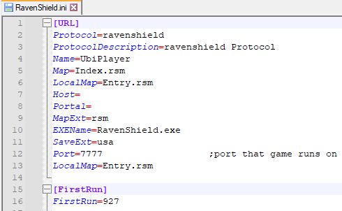
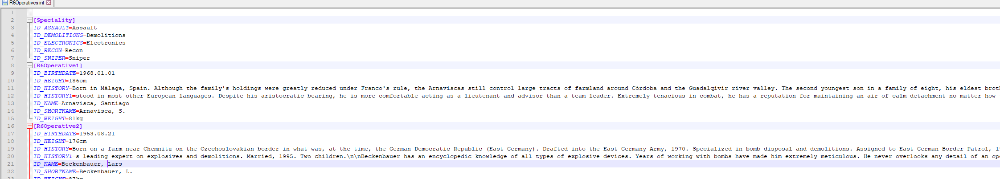
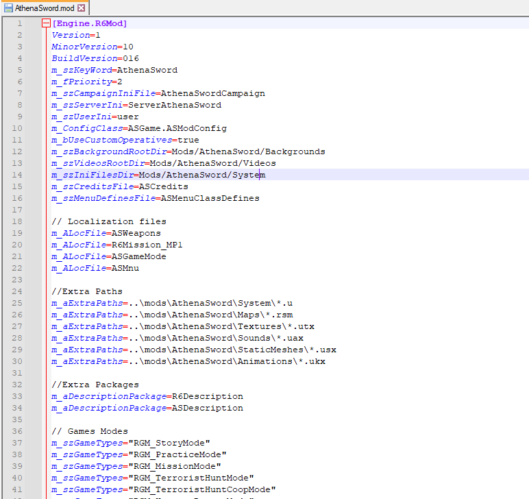

# Ravenshield File Types
## Configuration Files
    Hint: Set the language in Notepad++ to 'INI File' to enable highlighted text in .INI, .INT, and .MOD files.
1. *INI* 
- INI is a common format for configuration settings of a program or service. Sections are divided by headings, and listed in key-value pairs. Comments start with `;`. 
- Here is what Ravenshield.ini, one of the main configuration files, looks like.   
  

2. *INT*  
These files are for displaying text within menus, such as Weapon descriptions and mission briefings, they can be edited to different languages or whatever is desired. This file is for the Rainbow operative details such as their nationality and bio.

3. *MOD*  
These files are for Mod configurations, every expansion pack including Ravenshield has one. They control the default AI, Player Controller, and pawn classes. They also control what packages get activated during game-play, which is a major component of mods but outside the scope of this guide. Supply Drops also has its own .MOD file becuase it has it's own mod directory and is launched from the same menu as the official expansions.
- Your machine will likely detect these as video files if you try to double-click it, instead always right-click and chose 'Edit with Notepad++' from the context menu to open and edit.  

    - Note that comments start with `//` in these files. 
## Map Template Files  
1. *TPT*  
Terrorist template files are assigned to each map[^1]
[^1]: In the expansions, some maps are grouped together and associated with a single .tpt file, while others just use default files. The only way to find out for certain which files it uses is opening the map in the editor and going through each deployment zone. More on that in another guide.
2. *TPH*  
Hostage template files work just like TPT files, they control what Hostage model is in the map and their behavior.  
- Refer to my [Template Editing Guide](TemplateEditing.md) for more info on modifying these.
## Unreal Packages
1. *RSM* :
Ravenshield Map file.
2. *UTX* :
Unreal Texture package.
3. *UKX* :
Unreal skeletal animation package.
4. *UAX* :
Unreal audio package.
5. *SBO* :
Not entirely clear, but they are linked to UAX files and contain the actual audio data.
6. *USX* :
Static Mesh package.
7. *U* :
A Compiled UnrealScript package. 
8. *UC* :
Unreal script source code file.
- See my guide [Exporting and Importing Assets](Assets/Markdown/../../Import_Export_Guide.md) for more info on how to turn your files into Unreal packages. 
