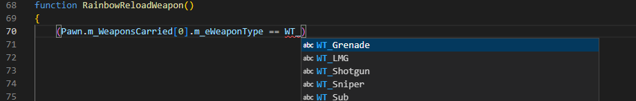

# The Unofficial Ravenshield Integrated Development Environment Guide

## Tools needed

1. Twi's SDK
2. Visual Studio Code
   1. Unreal Script Extension
   2. Powershell 7 running in built-in Terminal

## Set up Ravenshield SDK

1. Extract the files to any location on your machine.
2. Locate the file `SDKtoolbelt.bat` and right click->create a shortcut on the desktop or wherever is convenient. 
3. Run the tool, you'll see a command-line prompt with a blue background. Type `new` and enter the name of your project when prompted.
  - Type 'help' to see all commands. 
4. Close the toolbelt, navigate to the `Code Enviroment` folder and find your new project folder. For any future projects, you can simply copy and paste this folder and rename it, or just create a new folder with the 'classes' folder within it.
5. Your new `.uc` code files will go in the `classes` folder within your project folder. 

## Set up Workspace in Visual Studio Code

1. Go to `File->Add folder to Workspace` and first add the `1.56 Source Code` folder from the SDK.
2. Visual Studio Code should prompt you in the bottom right-corner to install the Unreal extension as soon as it detects a .uc file type. Agree to install, the extension or install it [manually](https://marketplace.visualstudio.com/items?itemName=EliotVU.uc).
3. Go back to `File->Add folder to Workspace` and now add the folder for the project you created in the previous section. Now you can view or edit your classes, or create new ones.
4. Save this workspace by going to `File->Save Workspace As` and save the workspace file to any location. You can now open it in future sessions (if it doesn't open automatically) by going to `File->Open workspace from file`.
5. The extension works by indexing the source code folder and detecting the context of your code, and using that as a library for you when you create new classes and code. 
- For example, if you start to type an object you will see *intellisense-like* prediction assistance with the dot operator, and will give you an error cue if you try to use an object that is not available to that class. Here, `WT_` is the prefix for the values in an enumerator for the weapon type and you can see the different values that pop up. The extension makes this available because it understands the context of this function and what objects and properties it inherits. 

- It also allows you to "view definition" for ALMOST any class or function you come across by taking you to the code file where the object is defined. I say almost because I have seen cases where it doesn't detect the proper location.
- The error messaging from the extension is far from perfect so always try to compile first from the SDK and always go by the error from the SDK output. The compiler error messaging on the other hand is surprisingly very accurate, it will almost always point you exactly to the code that needs fixing. The extension is just there for guidance and has no effect whatsoever on the compiler.
- Sample Workspace Layout
  add picture of VS Code layout

## Set up automation Pipeline

* This section assumes you have a project already set up that compiles successfully. This will help you set up an automated system for compiling and moving your files to the game directory
1. Locate the [Ravenshield-CompileMove.ps1](Tools/../../Tools/Ravenshield-CompileMove.ps1) Powershell file in this repo.
   - Edit all variables to match your system path and project name
2. Locate the batch file [Custom_compile.bat](Tools/../../Tools/compile_Custom.bat) and enter your project name where you see `<EnterProjectHere>` on lines 8 and 12. 
3. 'Stripping' the file of source code is usually only necessary when you are releasing your mod for download, for the simple fact that you may need to peek inside at the source code if you lose track of which version of the file you are testing. I'll do a separate section on how to strip later on because it can cause major issues if you do it incorrectly. For this guide, we'll leave it commented out in the script and move on.
4. Check your variables again, and then run the script from Visual Studio Code. If you run from the Powershell ISE, it will work fine but usually it will open the batch file in a separate terminal, and then close as soon as it's done. This prevents you from seeing if it compiled successfully and what the errors are. From VS Code you won't have this issue.
5. If you see the output `Files copied, Game is ready to start` in the terminal the script worked as planned and your file is now in the correct location. If it didn't compile, you'll see `Compile failed, check error message` and you can start debugging from the line given in the error output. 
6. As you continue to run the script, it will automatically place your previous files in the backup location you defined with a time-stamp appended to the file-name. 

