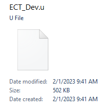
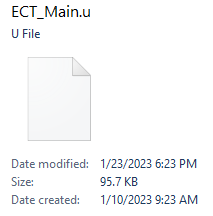

# Stripping Source Code from UnrealScript Packages
The default compile setting of the Ravenshield SDK does not strip source code from the package. For testing this is not an issue, but in production it means that anyone who downloads your mod can open the class file in a tool called Unreal Package Tool, and see your comments and code just as you made it. There are no guarantees it will be 100% accurate, so you really are not doing any favors by leaving the source code viewable. I find the UTPT very useful, but it is not wise to copy and paste code directly from there as it can lead to compile errors (reach out to the creator instead or join the Team Rainbow Modding Discord). Also, if you are like me and use a heavy amount of comments in your code, the compiled file becomes large. That's where stripping comes into play. Twi's SDK has a built in feature that you can use right after compiling to strip the source code and reduce the file size to as much as 20% it's original size. Now, users will still be able to view de-compiled (in other words, it is psuedo-code not source code) versions of your code in the UTPT, but they won't be able to see comments and I believe that is desired. Comments should only be seen by others who you plan on collaborating with in development, not end users. The UTPT is quite powerful and can even de-compile the vanilla game files, and there is nothing you can do to prevent it. Stripping has to be done correctly else I've seen it have strange effects on your compiled file. It is possibly to modify the `strip.bat` batch script but for tutorials sake I will use the default.

## Instructions for Code Stripping

1. Compile your UnrealScript class from Twi's SDK and locate your `.u` file, by default it will be in the top level **SDK2** folder.
2. Enter the command `strip` in the SDK2 CLI, and then enter your project name ***with the `.u` extension included***. Example: `MyMod.u`.
3. View the output, if successful the stripped file will be back in the Top Level **SDK2** folder. 

## Compare File Sizes
* Here is an example of a compiled `.u` file *without* the strip operation :  

* Here is an example of a compiled `.u` file *after* the strip operation :  
