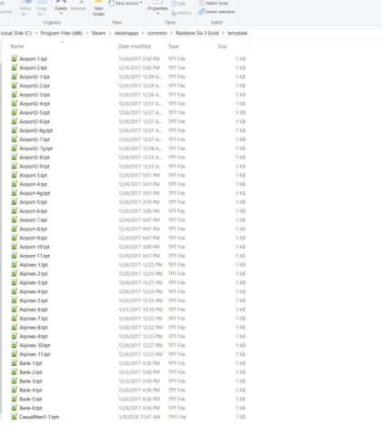
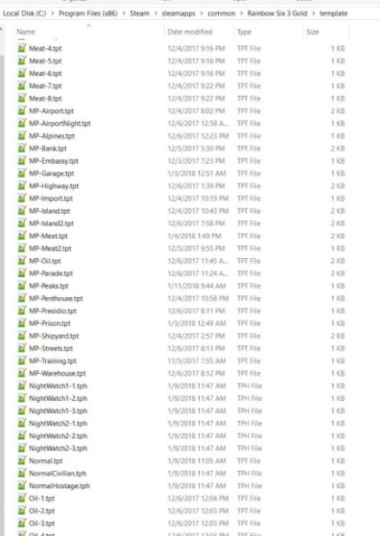
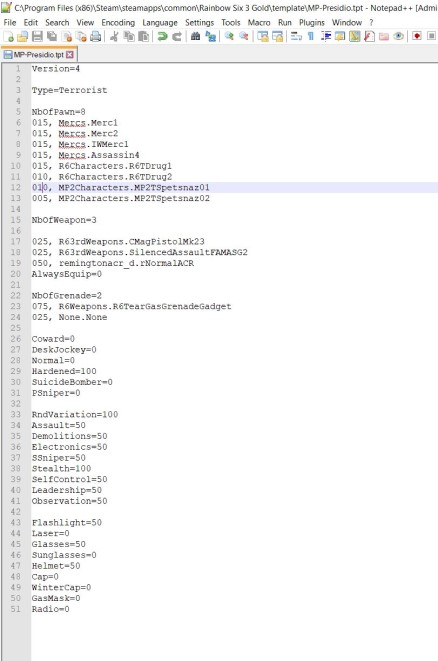
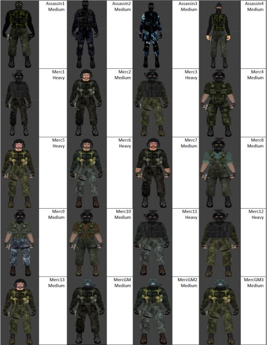
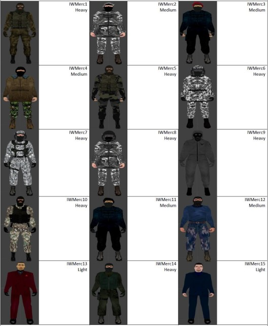

# Customizing Enemy Template Files
 The terrorists you see in a map are controlled by template files (extension '.tpt') that contain different classes, weapons, and gear with a corresponding percentage. Let’s take a look at the ‘template’ folder in the main Ravenshield directory. It should look like this:

- You’ll notice each mission has several different files, such as ‘Alpines -1’ and ‘Alpines 10’. These file-names are associated with different spawn points inside the map, to generate a random assortment of different types of terrorists. One file may be tied to a Sniper spawn point, another may be a campaign character like Gospic or Gutierrez. You can edit the contents within these files, but you cannot add any new ones without editing the map file. The Unreal Editor that comes with the game has a Template file builder, but I found it to be incomplete and you’ll save time if just get used to editing them as text files. In the second image you'll see filenames that start with ‘MP –‘, these are for Terrorist Hunt, Hostage Rescue, and Lone Wolf. While campaign missions have several template files, custom missions only use 1 per map. In addition to the campaign custom-missions, there are several multiplayer maps that you can select as well. Let’s take a look at ‘MP-Presidio’, a small map where you can easily test your custom .tpt files. This is what mine looks like when I open with a text editor, this one is just for the tutorial so yours will be different.

- Starting from the top, you’ll see ‘Version=4’ or ‘Version=5’, and then ‘Type=Terrorist’. Always leave these as they are. Where you see ‘NbOfPawn=’ is where you can start editing. You can enter however many number of tangos you wish, as long as their percentages (numbers at the beginning of each line with the character type) add up to 100. Now take look at the name of the terrorist type. 'Merc' or ‘R6Chracters’ is the parent-class and then is followed by a period and the specific type, such as 'IWMerc1'. The easiest way to view what they look like is to keep a reference image, like the ones I made below.
## Mercernary Reference Images

- Moving on to the weapon section, the same rules apply: enter the number of weapons, and then give them a corresponding percentage of how likely you want them to appear. If you want to change the weapons listed, again just pay attention to what you are entering. The third weapon listed is the ACR from Twi's Supply Drop, I recommend using Unreal Package Tool to find the class names. For grenades, you can give them a flash, gas, or frag, or just use ‘None.None’ but make sure to count it as an object. The next section is terrorist’s personality. Again, they must add up to 100. They all function pretty much as expected and control their tendency to run when they see a threat. The next section is their skill attributes, increasing them is always fun. ‘RndVariation’ is the range of variation to be added/subtracted to each skill. These fields can be any number from 0-100, and setting them all to 100 is perfectly fine. Of course, if you set ‘RndVariation’ to 100, then their skills will then be anywhere from 0-100.

- The last section is attachments. ‘Flashlight’ works just as expected, and you can enter any number for the chance that they appear in-game attached to terrorist’s weapons. The only other attachments that work are glasses, sunglasses, and helmets(looks more like a gas-mask), some of my guys can use them but for the ones that have the new head-gear I would leave this stuff alone.

- Double and triple check your math before running the mission, and use UTPT to check your class names are correct. If there are any errors, you will get a message as soon as you start the map, but it will more than likely not accurately state where the typo is and you’ll have to manually end the program. You can actually leave Ravenshield running while editing .tpt files, as long as you save it before running the map and there are no errors. This can be nice when you’re trying out new stuff. Editing the campaign mission .tpt files work the exact same way, just make sure you go through and edit each one if you want the changes to actually be reflected in your mission. Opening the maps in the Unreal Editor can be helpful if your not sure what files are associated, especially for some fan-made maps. Athena Sword and Iron Wrath have their own folders with template files, and they are not quite as conveniently named as the Ravenshield files. They work the same way, although there are several general files that are associated to several maps unlike Ravenshield.

In the Templates folder of this repository I added .tpt and .tph files that you can use as starting points for your custom missions. Let me know if you have any questions, and start adding the new enemies to your favorite maps!
