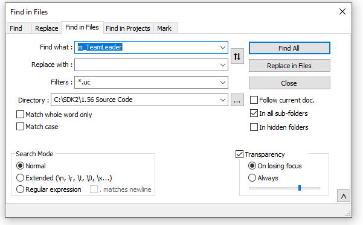

## Tools for Success

The following supplemental tools can assist in modding and overall development. 

### Twi's SDK

- The tool that makes all this possible! It works by setting up the UCC compiler and code folder structure with a command-line interface. My favorite feature of the SDK is the option to "strip" the source code and comments from your package, which helps protect your code and reduces file sizes. The compiler is also very precise in it's error messaging. 

### Powershell

- The built-in Windows scripting language is incredibly effective for automating tedious tasks that you'll be doing repeatedly, such as renaming files and copying them to and from the game directory. Batch files and other scripts can also be used in tandem by *wrapping* them in your powershell code. The default version in Windows is 5.1, but if you install Visual Studio Code you can easily install version 7 via the built-in terminal. 
- The legacy Powershell ISE (Powershell Integrated Scripting Environment) is still awesome for developing scripts but for this use case, I prefer working from Visual Studio Code and not the legacy Powershell ISE for the simple fact that it executes the batch files and displays their output all in the same window as your code workspace. 

### Visual Studio Code

- An all-in-one code editor that can be set up as a workspace for your project.
- Features the [Unreal Script Extension](https://marketplace.visualstudio.com/items?itemName=EliotVU.uc) to get text highlighting and intellisense-like assistance with your source code. It's not perfect but worth using because there aren't any more official tools left for UnrealScript.
- Another great extension is [Markdown all-in-one](https://marketplace.visualstudio.com/items?itemName=yzhang.markdown-all-in-one) if you want to create a formatted readme for your mod. See this section for more info.
- Has supplanted the Powershell ISE as the premier script editor, simply open a .PS1 file and you will be given options to 'run selection' and 'run script' just like the ISE. 

### Notepad++

- Use for searching within files and also a versatile text-editor. An important part of compiling new classes is knowing the inheritance of the object and how it is referenced. See the [section](#power-searching-with-notepad) below for more.
- Set the language of Unreal files to `Java` or `C/C++` to enable highlighting. Also works for configuration files if you set to `INI File`.
- Also allows you to edit and search within `.mod` , `.ini`, `.int`, `.tph`, and `.tpt` files, all of which are critical to the Ravenshield architecture. See my [guide](Ravenshield_File_Types.md) on File types.
- VS Code can do almost everything NP++ can including searching but I always keep it in my toolkit because of it's speed and simplicity, and searching is superior in NP++ in my opinion. 
- See the [Testing and Debugging Guide](Debugging.md) for an example on how to use Regular Expressions for advanced pattern searching. 

### Unreal Editor  

- Found in the 'system' folder of the Ravenshield main folder.
- Primarily used for Map editing but also for importing textures, sound, and static meshes and creating Unreal assets. 
- Can be used for testing custom emmitters. 

### Map Convertor

- Tool used to change the version of new assets, a critical step in importing them into the game. 
- If you get an error message regarding missing OCX files, download them from [here](https://www.moddb.com/mods/raven-shield-software-development-kit/downloads/missing-ocx-files-for-map-build-converter)

### Github Desktop

- Optional for setting up a repository to protect your code. 

### Everything

- A powerful searching tool, helpful for managing multiple game installs and projects. It can search for text within files but I primarily use it for searching file-names.  
- Superior to Windows native searching in every way, see [section](#power-searching-with-everything) below for more info.

# Use Cases

## Power Searching with **Notepad++**

While I do most of my code editing in **VS Code**, I prefer to do my code searching from **Notepad++** because it is lightweight and fast. The interface of VS Code becomes cluttered with extensions.

1. The tool I use most is "Find within files" located in the 'search' context menu. Here, I am pointing it the full 1.56 source code folder and searching for the variable `m_TeamLeader` because I want to see it where it is first defined, how it is referenced by other classes, and how I can use it in a new class. If your search field includes other file types you may use the `*.uc` filter to only search Unreal code files. You can can make the search as broad or granular as needed.

2. The search results will be displayed in the bottom pane. Click on any line to instantly open that location in a file. 

3. This method can be used for all text-based file types. If you want to quickly find a specific setting or value in a configuration file but don't remember the file name, do a "find within files", filter for `.ini` or `.int` extensions, and search over the whole game directory to quickly pinpoint the location.  
   - Avoid searching the game directory without a file-type filter of some sort, otherwise Notepad++ will search through DLLs and U packages. This is wasteful and time-consuming. 

## Power Searching with **Everything**

How many times do you find yourself searching your machine for the same `.ini` or `.mod` files? How do you manage these when you have multiple game installs, and need to be able to easily see which directories have a specific mod? Or, the worst case happened and you copied a compiled file into the wrong location or with the wrong file-name, and need to be able to immediately find it. Windows Explorer has searching built-in, but I find it to be slow and has a poor interface for displaying results. Notepad++ as we know has great searching tools for *text*, but for *file-names* I use a different program. **Everything** is the perfect complement to your modding tools and will save you time. This also falls in line with my principle of keeping work streams in separate programs as a means of checking myself and using the right tool for the job.

The interface of Everything is very straightforward and requires no configuration. Enter anything in the search field and by default it will search the entire C: drive for matching `File Names`.

- The program only searches **within** files if you specify that in the Advanced Search tool, and we are leaving it just the way it is.  

You can change the file type in the options drop-down, but since it may not detect Ravenshield or Unreal files correctly, I'd rather just enter it explicitly in the search field. You can enter as many terms as needed in the search field, for example if I want to find all `.uc` files with `ECT` in the file name I simply enter `ECT .uc`. Everything will list all matches and conveniently show the full location and the date it was last modified. Additionally, you can right-click on a file and get the same context-menu as in Windows Explorer, so you can select `Edit in Notepad++`, `Open with` any program, or copy the full file path to the clipboard.  

## Using the Unreal Editor

The Ravenshield Unreal Editor should not to be confused with Unreal Engine 2, it is nowwhere close to the full licensed engine. It is a scaled-down version that the developers packaged with the game and allows for editing maps and creating Unreal assets. It has a clunky, outdated interface and in general I try to minimize time spent in the editor unless it is necessary because it tends to slow me down. The editor interface has 2 main components:
- Map Editor - Open any map (.rsm files) and edit as you desire. Map editing will be covered in a separate guide but I will never be able to match the guides created by RVSmaps, you can find the whole directories on Moddb.
- Asset Browser - View textures, watch skeletal mesh animations, listen to sound assets, or view 3D meshes. The import process is also handled here.

## Using the Map Convertor
The name of this program is slightly misleading because it actually is used for any Unreal asset, included audio, static meshes, and textures. To keep it brief, any time a file is saved in the Unreal Editor, it saved as version 1.6, the current version of the game. But in order for the asset to be imported into Unreal Script, the asset file must be converted to 1.56. This doesn't impact the code or the compiled file in any way, it will work in 1.60 this is simply a workaround for the import procedure. 

- Simply open a `.UTX`, `.UAX`, or `.USX` file and select 'Convert'.
- Very Important: Only do this for files in the `Code Enviroment` directory, and leave the converted files where they are! Do not copy these files into your "Playing" directory, they will not work there. Instead, make the habit of saving twice when you have your asset open in the Unreal Editor, once in the game directory, and again in the `Code Enviroment` directory. Than, process to converting with the tool when you are done in the editor.

## Using Git, Github, and Github Desktop
At a high-level, Git is a technology that tracks changes within source code files and creates a timeline every time the code is modified. It is a critical component within the professional software industry to control who can edit code, what gets changed, and how it gets restored if something goes wrong. Using it for a personal modding project may seem like overkill, but consider how long you plan on maintaining your code and how you'll keep it backed up if you migrate machines. I recomend taking the short time to learn the basics of Git and set up a repository for your work. Perhaps the greatest feature of Git technology is that it is extremely light and does not impact performance in any way. 

Github is a seperate but related technology that at a high-level allows you to host your git repositories, either publicly or privately. It is possilbe to create and maintain repositories with the core Git technology only, Github is simply a more user-friendly interface with built-in safety measures. Git is meant to protect your code, not make it more complicated, and that's why I prefer Github over Git natively. Simply create an account and you can freely host as many repositories as you desire. I host this public one for modding and development resources, and also a private repo for each mod. That includes a sperate one for the Vanilla and Supply Drops versions of Elite Counter-Terror, and an additonal one for my experimental build. It takes very little time to create, and in the long-run provides peace of mind and organization. It may have been wiser to maintain a single development repository for my entire Code Enviroment directory, but that would require adding file extensions that should be ignored to the Git tracking configuraiton file otherwise I would have a mess of unneeded files. This also has to be done correctly at the initialization of the repo. In the end, I settled on created individual ones and find it easier to track. 

Github Desktop is the software that streamlines the process of "cloning" your repository and edit it locally on your machine, or on the flip-side you can move a local repository into a remote branch that is stored on Github. 

### Git Key words
| Term | Definition |
| ----------- | ----------- |
| Branch | The repository can be split into branches to allow mutliple users to work independantly. The default branch is called Main |
| Commit | The act of saving a snapshot of the current working code and creating a timeline |
| Origin | The source that a repository is compared to fo  |
| Clone | The act of copying a remote repository onto a local file system for editing and use  |