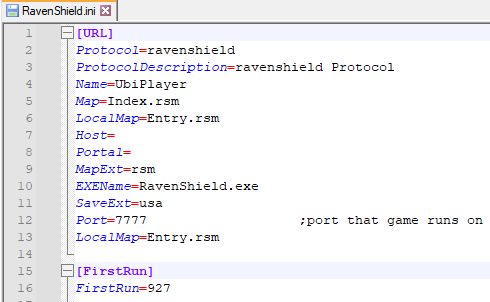
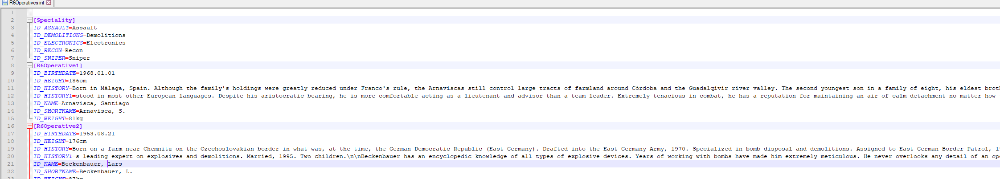

# Ravenshield File Types
## Configuration Files
1. INI 
- A common format for configuration settings of a program or service. Sections are divided by headings, and listed in key-value pairs. Here is what Ravenshield.ini, one of the main configuration files, looks like.  
  
    - Hint: set the language in Notepad++ to 'INI' for highlighted text in .INI, .INT, and .MOD files.
2. INT  
These files are for displaying text within menus, such as Weapon descriptions and mission briefings, they can be edited to different languages or whatever is desired. This file is for the Rainbow operative details such as their nationality and bio.

1. MOD  
These files are for Mod configurations, every expansion pack including Ravenshield has one. They control the default AI, Player Controller, and pawn classes. Supply Drops also has one becuase it has it's own mod directory.
- Your machine will probably detect these as video files, ignore that prompt and always chose 'Edit with Notepad+' from the context menu to edit.  

## Map Template Files
1. TPT
2. TPH
## Unreal Packages
1. RSM
2. UTX
3. UKX
4. UAX
5. SBO
6. USX
7. U

