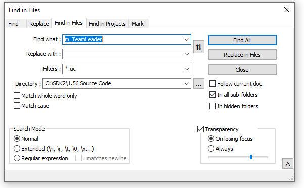

# The Unofficial Ravenshield Integrated Development Environment Guide

## Tools for Success

### Twi's SDK

- The tool that makes all this possible! It works by setting up the UCC compiler and code folder structure with a command-line interface. My favorite feature of the SDK is the option to "strip" the source code and comments from your package, which helps protect your code and reduces file sizes. The compiler is also very precise in it's error messaging. 

### Powershell

- The built-in Windows scripting language is incredibly effective for automating tedious tasks that you'll be doing repeatedly, such as renaming files and copying them to and from the game directory. Batch files and other scripts can also be used in tandem by *wrapping* them in your powershell code. The default version in Windows is 5.1, but if you install Visual Studio Code you should automatically get access to version 7 via the built-in terminal. 
- The legacy Powershell ISE (Powershell Integrated Scripting Environment) is still awesome for developing scripts but for this use case, I prefer working from Visual Studio Code and not the legacy Powershell ISE for the simple fact that it executes the batch files and displays their output all in the same window as your code workspace. 

### Visual Studio Code

- An all-in-one code editor that can be set up as a workspace for your project.
- Features the [Unreal Script Extension](https://marketplace.visualstudio.com/items?itemName=EliotVU.uc) to get text highlighting and intellisense-like assistance with your source code. It's not perfect but worth using because there aren't any more official tools left for UnrealScript.
- Another great extension is [Markdown all-in-one](https://marketplace.visualstudio.com/items?itemName=yzhang.markdown-all-in-one) if you want to create a formatted readme for your mod. See this section for more info.
- Has supplanted the Powershell ISE as the premier script editor, simply open a .PS1 file and you will be given options to 'run selection' and 'run script' just like the ISE. 

### Notepad++

- Use for searching within files and also a versatile text-editor. An important part of compiling new classes is knowing the inheritance of the object and how it is referenced. See the [section](#using-notepad-to-trace-object-inheritance) below for more.
- Set the language of Unreal files to 'Java' or 'C' to enable highlighting. Also works for configuration files.
- Also allows you to edit and search within `.mod` , `.ini`, `.int`, `.tph`, and `.tpt` files, all of which are critical to the Ravenshield architecture. See my [guide](Ravenshield_File_Types.md) on File types.
- VS Code can do almost everything NP++ can including searching but I always keep it in my toolkit because of it's speed and simplicity. 

### Unreal Editor

- Found in the 'system' folder of the Ravenshield main folder.
- Primarily used for Map editing but also for importing textures, sound, and static meshes and creating Unreal assets. 

### Map Convertor

- Tool used to change the version of new assets, a critical step in importing them into the game. 
- If you get an error message regarding missing OCX files, download them from [here](https://www.moddb.com/mods/raven-shield-software-development-kit/downloads/missing-ocx-files-for-map-build-converter)

### Github Desktop

- Optional for setting up a repository to protect your code. 

### Everything

- A powerful searching tool, helpful for managing multiple game installs and projects.
- Superior to Windows native searching in every way. 

## Set up Ravenshield SDK

1. Extract the files to any location on your machine.
2. Locate the file `SDKtoolbelt.bat` and right click->create a shortcut on the desktop or wherever is convenient. 
3. Run the tool, you'll see a command-line prompt with a blue background. Type `new` and enter the name of your project when prompted.
  - Type 'help' to see all commands. 
4. Close the toolbelt, navigate to the `Code Enviroment` folder and find your new project folder. For any future projects, you can simply copy and paste this folder and rename it, or just create a new folder with the 'classes' folder within it.
5. Your new `.uc` code files will go in the `classes` folder within your project folder. 

## Set up Workspace in Visual Studio Code

1. Go to `File->Add folder to Workspace` and first add the `1.56 Source Code` folder from the SDK.
2. Visual Studio Code should prompt you in the bottom right-corner to install the Unreal extension as soon as it detects a .uc file type. Agree to install, the extension or install it [manually](https://marketplace.visualstudio.com/items?itemName=EliotVU.uc).
3. Go back to `File->Add folder to Workspace` and now add the folder for the project you created in the previous section. Now you can view or edit your classes, or create new ones.
4. Save this workspace by going to `File->Save Workspace As` and save the workspace file to any location. You can now open it in future sessions (if it doesn't open automatically) by going to `File->Open workspace from file`.
5. The extension works by indexing the source code folder and detecting the context of your code, and using that as a library for you when you create new classes and code. 
- For example, if you start to type an object you will see *intellisense-like* prediction assistance with the dot operator, and will give you an error cue if you try to use an object that is not available to that class. Here, `WT_` is the prefix for the values in an enumerator for the weapon type and you can see the different values that pop up. The extension makes this available because it understands the context of this function and what objects and properties it inherits. 

- It also allows you to "view definition" for ALMOST any class or function you come across by taking you to the code file where the object is defined. I say almost because I have seen cases where it doesn't detect the proper location.
- The error messaging from the extension is far from perfect so always try to compile first from the SDK and always go by the error from the SDK output. The compiler error messaging on the other hand is surprisingly very accurate, it will almost always point you exactly to the code that needs fixing. The extension is just there for guidance and has no effect whatsoever on the compiler.
- Sample Workspace Layout
  add picture of VS Code layout

## Set up automation Pipeline

* This section assumes you have a project already set up that compiles successfully. This will help you set up an automated system for compiling and moving your files to the game directory
1. Locate the [Ravenshield-CompileMove.ps1](Tools/../../Tools/Ravenshield-CompileMove.ps1) Powershell file in this repo.
   - Edit all variables to match your system path and project name
2. Locate the batch file [Custom_compile.bat](Tools/../../Tools/compile_Custom.bat) and enter your project name where you see `<EnterProjectHere>` on lines 8 and 12. 
3. 'Stripping' the file of source code is usually only necessary when you are releasing your mod for download, for the simple fact that you may need to peek inside at the source code if you lose track of which version of the file you are testing. I'll do a separate section on how to strip later on because it can cause major issues if you do it incorrectly. For this guide, we'll leave it commented out in the script and move on.
4. Check your variables again, and then run the script from Visual Studio Code. If you run from the Powershell ISE, it will work fine but usually it will open the batch file in a separate terminal, and then close as soon as it's done. This prevents you from seeing if it compiled successfully and what the errors are. From VS Code you won't have this issue.
5. If you see the output `Files copied, Game is ready to start` in the terminal the script worked as planned and your file is now in the correct location. If it didn't compile, you'll see `Compile failed, check error message` and you can start debugging from the line given in the error output. 
6. As you continue to run the script, it will automatically place your previous files in the backup location you defined with a time-stamp appended to the file-name. 

## Using Notepad++ to Trace Object Inheritance

1. While I do most of my code editing in VS Code, I prefer to do my searching from Notepad++ because it is lightweight and fast. 
2. The tool I use most is "Find within files" located in the 'search' context menu. Here, I am pointing it the full 1.56 source code folder and searching for the variable `m_TeamLeader` because I want to see it where it is first defined, how it is referenced by other classes, and how I can use it in a new class. If your search field includes other file types you may use the `*.uc` filter to only search Unreal code files. You can can make the search as broad or granular as needed.

3. The search results will be displayed in the bottom pane. Click on any line to instantly go to that location in a file. 

4. This can be