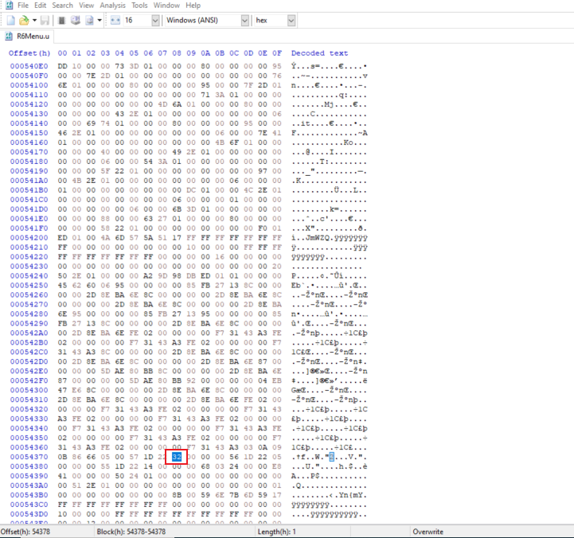
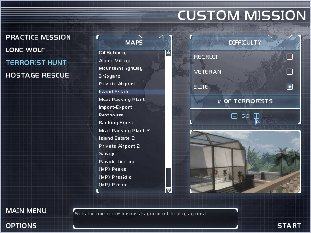

You'll need HxD, a free Hex-editor and I also recommend the Unreal Package Tool, or UTPT.

1. Make sure to create a back-up of the 'R6Menu.u' file located in the 'system' folder in the main Ravenshield directory, or you could always just use Steam or Uplay to verify the files and get it back to vanilla. Now run HxD and open 'R6Menu.u'.
2. Go to 'search', 'Goto' and then enter offset 54378. The value should be '23', the Hexadecimal equivalent of 35.
Note: To find this value yourself, use UTPT to open the 'R6Menu' file, locate the 'R6MenuCustomMissionNbTerroSelect' class, and right-click then select 'analyze raw data'. Look for the '23' towards the bottom and click on it to see the location.
3. Highlight '23' and then right-click and select 'fill selection'. Now enter a new value in the 'hex values' field, such as '32' to represent 50, and then click 'Ok'. You should see this:  
  
4. Save this file in HxD, exit and run the game. You should see you're new value in the custom mission menu!  
  
5. Keep in mind that if the map has less spawn points than the number you select, but luckily the map WILL still end if you kill all the spawned terrorists. I have made it to 50 on several vanilla maps but others capped out at 40. Some of the newer fan-made maps have a much greater number, like the Military Base V4.1 I show in one of my older videos. You'll have to experiment.  

